# Sensor

Review of **10 sensors** and **2 software platforms** used in our anxiety detection research — eye tracking, heart rate, skin conductance, video, and motion capture. Includes specs, comparisons, and sample data.

---

## Sensors & Tools

### Eye Tracking

<table>
  <tr>
    <td align="center" valign="top" width="33%">
       
      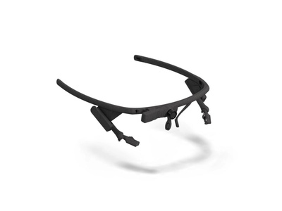 
      <b>Pupil Labs Core</b> 
      Head-mounted eye tracker 
      Dark pupil + 3D model · 5-point calibration 
      1080p @30 Hz · 720p @60 Hz · 480p @120 Hz
    </td>
    <td align="center" valign="top" width="33%">
       
      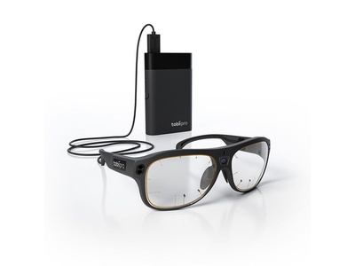 
      <b>Tobii Pro Glasses 3</b> 
      Wearable eye tracker 
      100 Hz gaze sampling 
      &nbsp;
    </td>
    <td align="center" valign="top" width="33%">
       
      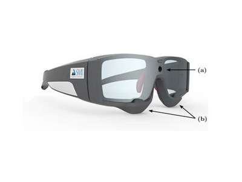 
      <b>SMI Eye Tracking Systems</b> 
      Research-grade eye tracker 
      60 Hz sampling 
      &nbsp;
    </td>
  </tr>
</table>

---

### Cardiac & Electrodermal

<table>
  <tr>
    <td align="center" valign="top" width="25%">
       
      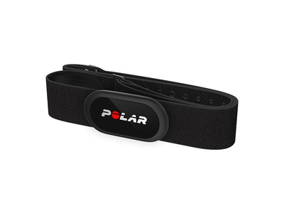 
      <b>Polar H10+</b> 
      Chest strap — HR, HRV, IBI 
      64 MHz microprocessor · ECG sensor
    </td>
    <td align="center" valign="top" width="25%">
       
      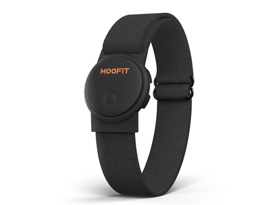 
      <b>Moofit HW401</b> 
      Wearable heart rate monitor 
      64 MHz microprocessor · ECG sensor
    </td>
    <td align="center" valign="top" width="25%">
       
      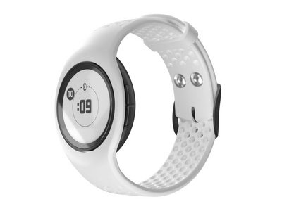 
      <b>Empatica E4 Wristband</b> 
      Wrist wearable — EDA, BVP, temp, accel 
      Multi-sensor (EDA + BVP + temp + accel)
    </td>
    <td align="center" valign="top" width="25%">
       
      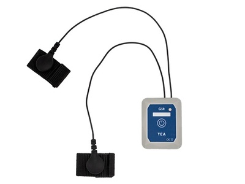 
      <b>TEA CAPTIV T-SENS GSR</b> 
      Skin conductance (wireless) 
      32 Hz sampling · 20 g · 8 hr battery
    </td>
  </tr>
  <tr>
    <td align="center" valign="top" width="25%">
       
      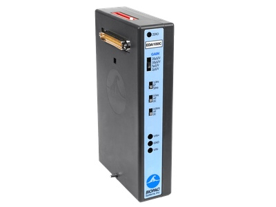 
      <b>BioPac EDA Sensors</b> 
      Electrodermal activity measurement 
      &nbsp;
    </td>
    <td></td>
    <td></td>
    <td></td>
  </tr>
</table>

---

### Video & Motion Capture

<table>
  <tr>
    <td align="center" valign="top" width="33%">
       
      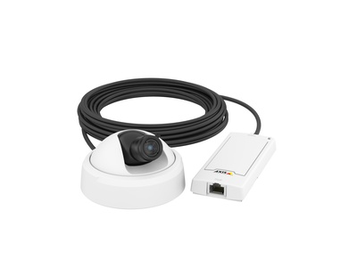 
      <b>AXIS P1275 Camera</b> 
      Network surveillance camera 
      HDTV 1080p · WDR-Forensic capture
    </td>
    <td align="center" valign="top" width="33%">
       
      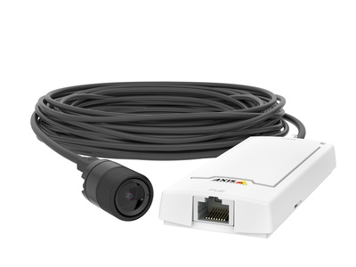 
      <b>AXIS P1245 Camera</b> 
      Compact network camera 
      HDTV 1080p
    </td>
    <td align="center" valign="top" width="33%">
       
      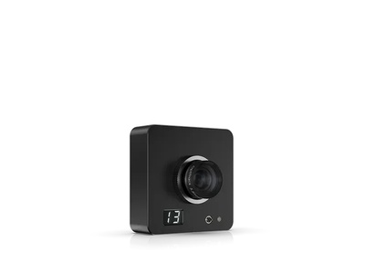 
      <b>OptiTrack (Slim X13)</b> 
      Motion capture system 
      &nbsp;
    </td>
  </tr>
</table>

---

### Software

<table>
  <tr>
    <td align="center" valign="top" width="50%">
       
      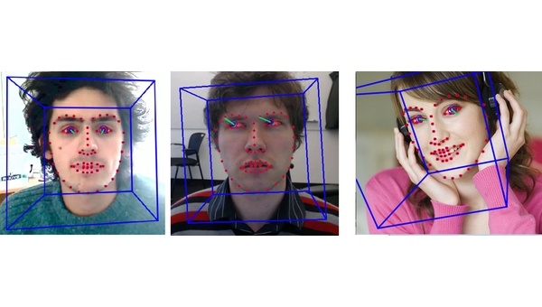 
      <b>OpenFace</b> 
      Open-source facial analysis 
      Landmark detection · Head pose · Action unit recognition · Gaze estimation
    </td>
    <td align="center" valign="top" width="50%">
       
      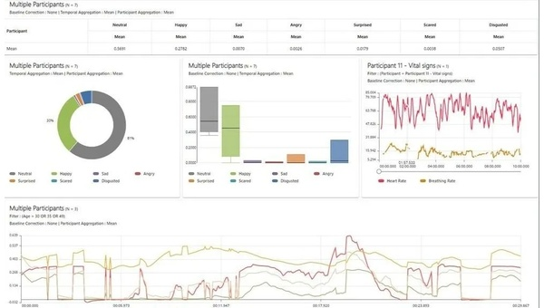 
      <b>Noldus FaceReader</b> 
      Commercial facial analysis 
      468-point face model · 20 Action Units · 99% accuracy on ADFES
    </td>
  </tr>
</table>

---

## Experiment Protocol

From `Experiment Scenario.pdf` — a 5-phase, 30-minute session:

| Phase | Duration | Description |
|-------|----------|-------------|
| **1. Interview** | 10 min | Semi-structured demographic interview, informed consent |
| **2. Sensor Setup** | 5 min | Fit Pupil Labs Core, Polar H10+, and Moofit HW401; calibrate |
| **3. Baseline** | — | Reading task to get resting-state measurements |
| **4. Psychometric Testing** | 15 min | HADS, STAI, BFI-10, and FQ on screen while sensors record |
| **5. Debrief** | — | Participant feedback; mental health resources provided if needed |

---

## Anxiety Detection Thresholds

From `Threshold.pdf` — literature-based thresholds used for detecting anxiety:

| Sensor | Measure | Anxiety Threshold | Source |
|--------|---------|-------------------|--------|
| Pupil Labs Core | Fixation duration | < 250 ms | Laeng et al. (2012) |
| Pupil Labs Core | Saccade peak velocity | > 500 deg/s (for ≥ 15° saccades) | Di Stasi et al. (2013); van der Lans et al. (2013) |
| OpenFace | Brow furrowing (AU 4) | ≥ 3.0 on 0–5 intensity scale (FACS C) | Ekman & Friesen (1978); Gavrilescu & Vizireanu (2019) |
| OpenFace | Lip tightening (AU 24) | ≥ 3.0 on 0–5 intensity scale (FACS C) | Ekman & Friesen (1978); Gavrilescu & Vizireanu (2019) |
| TEA GSR | Skin conductance response | > 0.05 µS | Boucsein (1992) |
| Polar H10+ / Moofit | RMSSD | < 50 ms | ESC/NASPE Task Force (1996) |
| Polar H10+ / Moofit | SDNN | < 50 ms | ESC/NASPE Task Force (1996) |

---

## Documentation

| Document | What's in it |
|----------|-------------|
| `List of Sensors.pdf` | Specs and capabilities for each sensor |
| `Sensor Comparison.pdf` | Side-by-side comparison |
| `Sensors (Eye-tracking, HRV, GSR, Camera).pdf` | Overview by measurement type |
| `OpenFace vs Noldus.pdf` | Facial analysis software comparison |
| `Experiment Scenario.pdf` | Experimental protocol |
| `Threshold.pdf` | Anxiety detection thresholds with references |

---

## Sample Data

The `Sensor's data/` folder has CSVs from psychometric testing sessions (2024-06-13 to 2024-06-24). Full column definitions are in the [data dictionary](Sensor's%20data/DATA_DICTIONARY.md).

| File | Rows | Description |
|------|------|-------------|
| `HRV.csv` | 265 | Per-question biometric summary — pupil dilation & blink rates aggregated per question across all 3 sessions. **Note:** despite the filename, this file contains eye tracking metrics, not raw HRV data. See [`DATA_DICTIONARY.md`](Sensor's%20data/DATA_DICTIONARY.md) for column details. |
| `hr.csv` | 4033 | Heart rate from multiple sensors (Polar H10+, Moofit) with confidence scores |
| `ibi.csv` | 2395 | Inter-beat interval series |
| `Psychometric_Test_Results.csv` | 88 | Question-level responses (HADS, STAI-S, STAI-T, FQ, BFI) with timestamps |
| `sed.csv` | 34172 | Raw eye tracking — head position, gaze direction, pupil size, eye openness |
| `sed_fix.csv` | 34172 | Processed eye tracking — adds gaze difference, fixation detection, fixation duration |

---

## Quick Start

See [`analysis/explore_data.ipynb`](analysis/explore_data.ipynb) for a walkthrough that loads each CSV and plots heart rate, pupil dilation, fixation durations, and HRV metrics from the sample session.

---

## What You Can Use This For

- Picking sensors for a multimodal physiology study
- Comparing what each device can actually do
- Designing experiments with multiple concurrent sensors
- Understanding the data formats each platform outputs

---

## Related Repos

- [Multimodal-Multisensor](https://github.com/urme-b/Multimodal-Multisensor) — Longitudinal study using these sensors
- [Multimodal](https://github.com/urme-b/Multimodal) — Analysis of the collected data
- [CalmSense](https://github.com/urme-b/CalmSense) — Stress detection system built on multimodal signals

---

## Tech Stack

Pupil Labs Core · Polar H10+ · Moofit HW401 · TEA CAPTIV T-SENS · Empatica E4 · OpenFace · Noldus FaceReader · OptiTrack · AXIS Cameras

## Topics

Biometric Sensors · Eye Tracking · Heart Rate Variability · Galvanic Skin Response · Electrodermal Activity · Anxiety Detection · Psychometric Testing · Multimodal Sensing · OpenFace · Pupil Labs

## License

[MIT](LICENSE)
